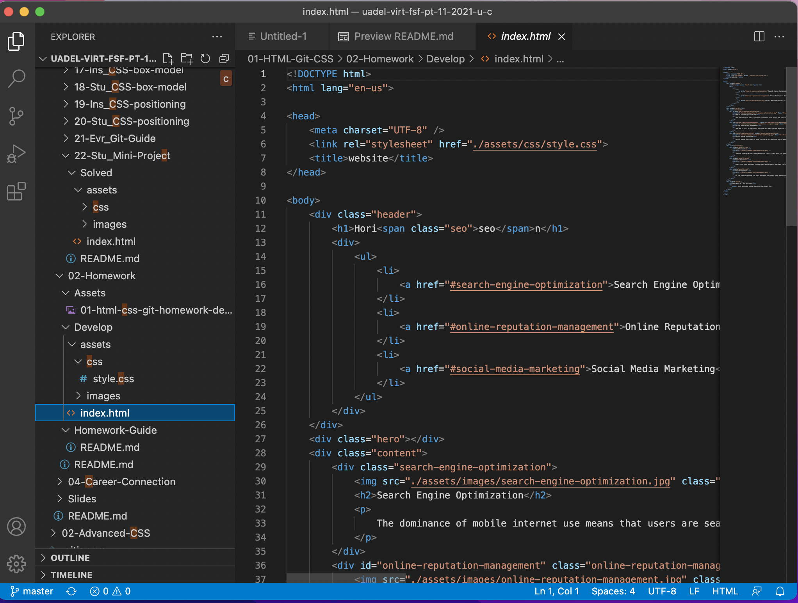

# first-homework = code refractor

## Description

- The main aim of this task was to refactor existing code for a website highlighting a SEO company. 
- The code had been written for the website however accessibility was an issue that needed resolving as the code was no semantic and did not meet accessibility standards. This needed addressing to improve the accessibility of the website, which would also help search engine optimization, along with improving the structure and flow of the code. The CSS file was also consolidated to remove repetitive styling code and edited to follow same order and structure of html.
- Given the importance of accessibility to website design, this was an important issue to address and one which would help the company out.
- Learnings taken from this project include correct use of semantic html code, best practise for sturcuring code in a document, and then deploying this code to github and the internet.

## Horiseon code pre and post refactoring

The following screenshot indicates the structure of the code prior to refactoring, which focused on using div tags rather than semantic tags. Whilst the website was still viewable with working links (except one which was fixed), it did not meet reqwuired accessibility standards and as such needed refactoring.

The next screenshot shows the code after semantic html tags have been added to the text to give it logical structure and meet accessibility standards.

